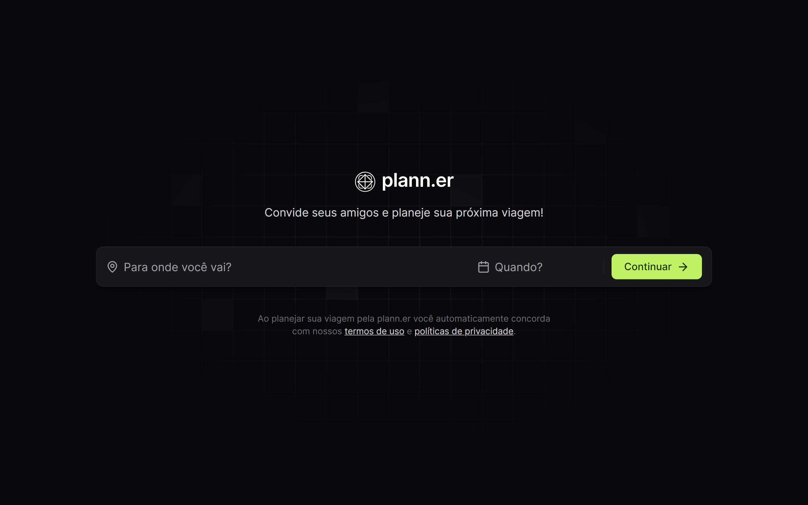

<h1 align="center">
  <a href="https://nlw-journey-trilha-react.vercel.app">
    
  </a>
</h1>

## 📃 Roteiro

- [📃 Roteiro](#-roteiro)
- [❓ Sobre](#-sobre)
- [🛠️ Tecnologias](#️-tecnologias)
- [📋 Pré-requisitos](#-pré-requisitos)
- [🔧 Instalação](#-instalação)
- [⚙️ Executando](#️-executando)
- [🔖 Layout](#-layout)
- [🌐 Deploy](#-deploy)
- [🧑‍💻 Autor](#-autor)
- [📝 Licença](#-licença)

<p align="center">
  <a href="https://nlw-journey-trilha-react.vercel.app">
    
  </a>
</p>

## ❓ Sobre

<p align="justify">
  O projeto é um site desktop para montar planos de viagem com amigos, registrar atividades e links úteis. Esse é um dos projetos do evento NLW Journey, um dos conteúdos disponíveis para alunos da Rocketseat.
</p>

## 🛠️ Tecnologias

O projeto foi desenvolvido com as seguintes tecnologias:

- [React](https://react.dev)
- [Vite](https://vitejs.dev/)
- [Tailwind CSS](https://tailwindcss.com)

## 📋 Pré-requisitos

Verifique aos seguintes pré-requisitos para poder instalar e executar o projeto:

1. Ter instalado um editor de código: [VS Code](https://code.visualstudio.com/download)
2. Ter instalado o [Git](https://git-scm.com/downloads)
3. Ter instalado o [Node.js](https://nodejs.org/en)

## 🔧 Instalação

Siga o passo a passo para instalar o projeto:

1. Abra o terminal e clone o repositório do projeto:

   ```bash
   git clone https://github.com/pedroeuzebiooo/nlw-journey-trilha-react
   ```

## ⚙️ Executando

Siga o passo a passo para executar o projeto:

1. Entre na pasta do projeto clonado:

   ```bash
   cd nlw-journey-trilha-react
   ```

2. Abra a pasta do projeto clonado no editor de código de sua preferência. Caso seja o [VS Code](https://code.visualstudio.com/download) digite o comando:

   ```bash
   code .
   ```

3. Instale as dependências do projeto:

   ```bash
   npm install
   ```

ou:

```bash
npm install
```

ou:

```bash
pnpm install
```

4. Execute o projeto:

   ```bash
   npm run dev
   ```

ou:

```bash
yarn run dev
```

ou:

```bash
pnpm run dev
```

## 🔖 Layout

Visualize o layout do projeto através <a href="https://www.figma.com/community/file/1392276515495389646/nlw-journey-planejador-de-viagem">Desse Link</a>. É necessário ter conta no <a href="https://figma.com">Figma</a> para acessá-lo.

## 🌐 Deploy

- [Exibir projeto](https://nlw-journey-trilha-react.vercel.app)

## 🧑‍💻 Autor

<table>
  <tr>
    <td align="center">
      <a href="https://github.com/pedroeuzebiooo">
        
        <br />
        Pedro Euzebio
      </a>
    </td>
  </tr>
</table>

## 📝 Licença

O projeto está sob licença MIT. Veja o arquivo [LICENSE](./LICENSE) para mais detalhes.
